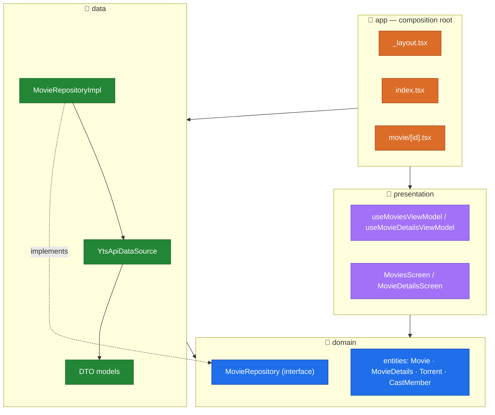
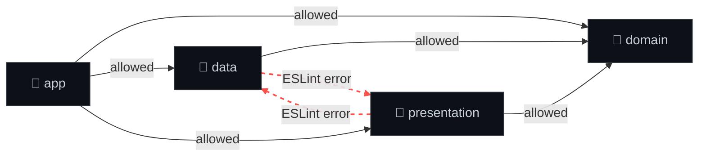
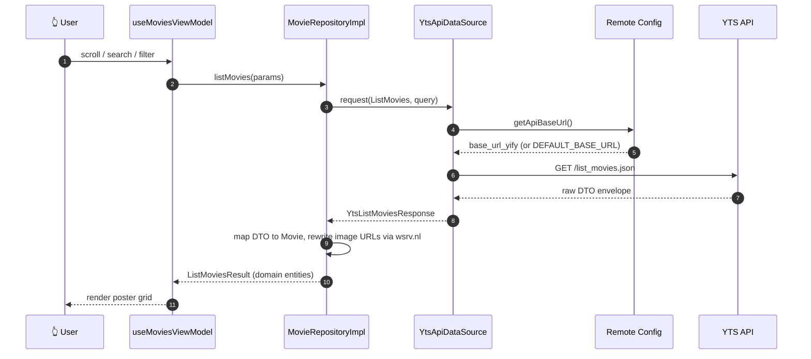
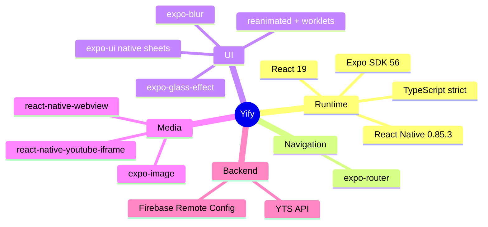

<div align="center">

# 🎬 Yify

**A buttery-smooth, liquid-glass movie browser built with Expo + React Native.**

Browse the YTS catalog, dig into rich movie details, watch trailers inline, and filter
thousands of titles — all wrapped in iOS 26 liquid-glass UI and a strict
clean-architecture core.

[](https://docs.expo.dev/)
[](https://reactnative.dev/)
[](https://www.typescriptlang.org/)
[](#-architecture)
[](#-get-started)

</div>

---

## ✨ Features

- 🖼️ **Infinite-scroll poster grid** — responsive column count that adapts to viewport width, page-size-50 pagination, pull-to-refresh.
- 🔍 **Debounced search** — 400 ms debounce, instant clear, no jank.
- 🧊 **Liquid glass everywhere** — native `expo-glass-effect` on iOS 26, graceful `BlurView` fallback on older iOS and Android.
- 🎚️ **Native filter sheet** — quality / rating / genre / sort, in a device-corner-radius bottom sheet that looks identical on iOS and Android.
- 🎥 **Movie details + inline trailer** — full metadata, cast, screenshots, parental guides, and an embedded YouTube trailer player.
- ☁️ **Firebase Remote Config** — API base URL is fetched at runtime, so the backend can move without an app update.
- 🧭 **Scroll affordances** — scroll-to-top, a live "visible index / total" indicator, all in a glass bottom bar.

---

## 🏛️ Architecture

Yify follows **clean architecture** — the same module shape you'd build with Gradle
modules on Android. Three independent layers, each with a single public barrel
(`index.ts`), wired together only at the `app` composition root.



### The one rule that matters

> **`domain` depends on nothing. `data` and `presentation` depend only on `domain`. They may never import each other.**

This is **enforced by ESLint** (`import/no-restricted-paths` in `eslint.config.js`) — an
illegal cross-module import fails `npm run lint`. Cross-module imports must go through a
module's barrel (`@/domain`), never a deep path.



---

## 🔄 How a movie loads

From tap to pixels — the request path through every layer:



---

## 🗂️ Project layout

```
yify/
├─ app/                      # 📱 expo-router entry points (composition root)
│  ├─ _layout.tsx            #    Stack, theming, Firebase init
│  ├─ index.tsx              #    Home — wires data → presentation
│  └─ movie/[id].tsx         #    Movie details route
├─ data/                     # 💾 YTS API + DTO → entity mapping
│  ├─ datasources/           #    YtsApiDataSource, YtsEndpoint enum
│  ├─ models/                #    one DTO per file
│  └─ repositories/          #    MovieRepositoryImpl
├─ domain/                   # 🧠 pure interfaces & entities (zero deps)
│  ├─ entities/
│  └─ repositories/
├─ presentation/             # 🎨 screens, view models, shared UI
│  ├─ movies/                #    MoviesScreen, MovieDetailsScreen, view models
│  ├─ components/            #    LiquidGlassView, ThemedText/View
│  └─ hooks/                 #    color scheme, theme color, corner radius
├─ lib/                      # 🔌 Firebase + Remote Config (native + .web split)
├─ config/                   # 🔥 google-services.json / GoogleService-Info.plist
└─ scripts/                  # 🛠️ android debug/release build helpers
```

---

## 🚀 Get started

```bash
# 1. install
npm install

# 2. (optional) Firebase — copy and fill in your keys
cp .env.example .env

# 3. start the dev server
npm start
```

### Run on a platform

| Command | What it does |
| --- | --- |
| `npm run ios` | iOS simulator (needs Xcode at `/Applications/Xcode.app`) |
| `npm run android` | Android emulator / connected device |
| `npm run android:debug` | Scripted Android **debug** build |
| `npm run android:release` | Scripted Android **release** build (standalone APK) |
| `npm run web` | Browser |
| `npm run lint` | ESLint **+ module-boundary enforcement** |
| `npm run prebuild` | Regenerate native `ios/` & `android/` |

> 💡 Release builds embed the JS bundle — no Metro required. Unplug and go.

---

## 🧰 Tech stack



> ⚠️ **Version ceiling:** React Native is pinned to **0.85.3**. RN 0.86 breaks Expo SDK 56/57
> native modules (the JSI `Runtime` → `IRuntime` ABI change) and crashes at launch.

---

## 🔥 Firebase Remote Config

The YTS API base URL is **not hardcoded** — it's resolved at runtime from Remote Config
key `base_url_yify`, falling back to the data module's `DEFAULT_BASE_URL`. Native uses
`@react-native-firebase/remote-config`; web uses the Firebase JS SDK (gated on
`isSupported()`). The `data` module stays completely Firebase-agnostic — the base URL is
injected as a `() => string` provider from `app/index.tsx`.

Firebase degrades gracefully: with no `.env` keys, the app simply uses the default URL.

---

## 🤝 Contributing

1. Keep the layers honest — if `npm run lint` fails on an `import/no-restricted-paths`
   rule, you crossed a module boundary. Route it through a barrel or rethink the dependency.
2. One DTO / entity per file.
3. Reuse `ThemedText` / `ThemedView` / `LiquidGlassView` instead of new styled primitives.

---

<div align="center">

Built with 🎥 and a lot of liquid glass.

</div>
