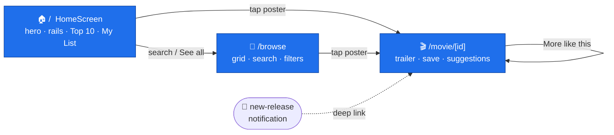
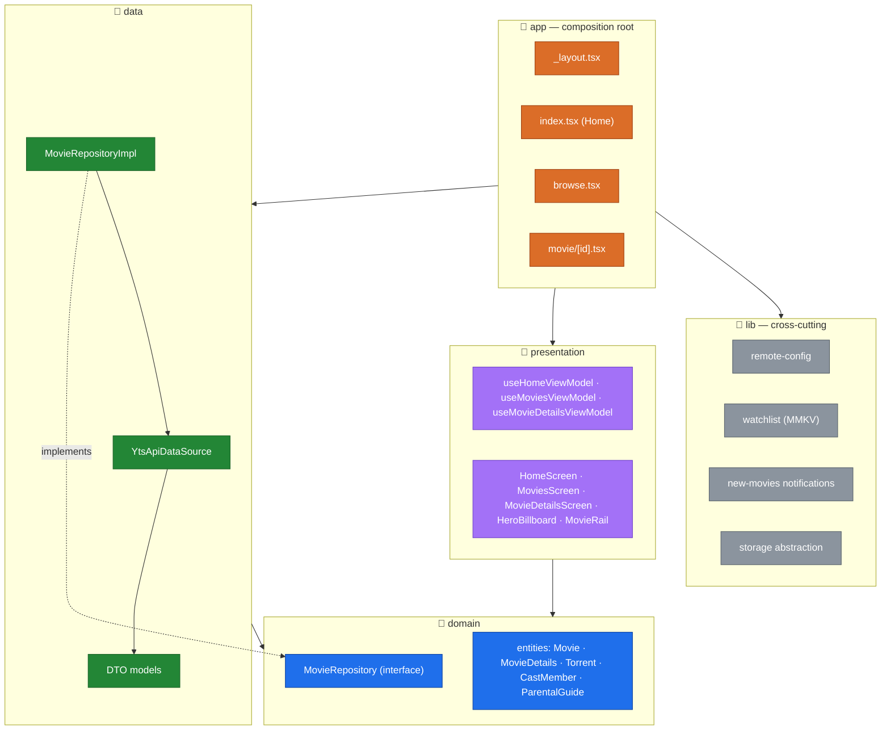
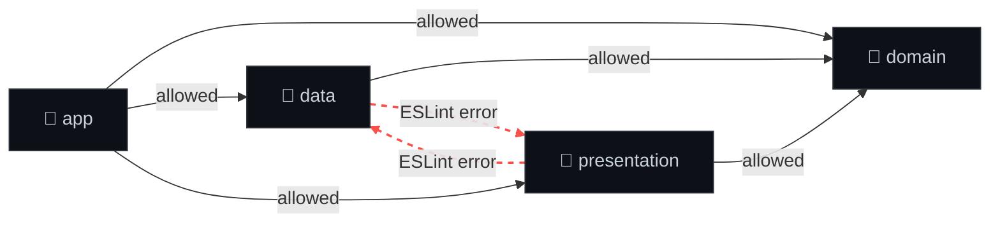
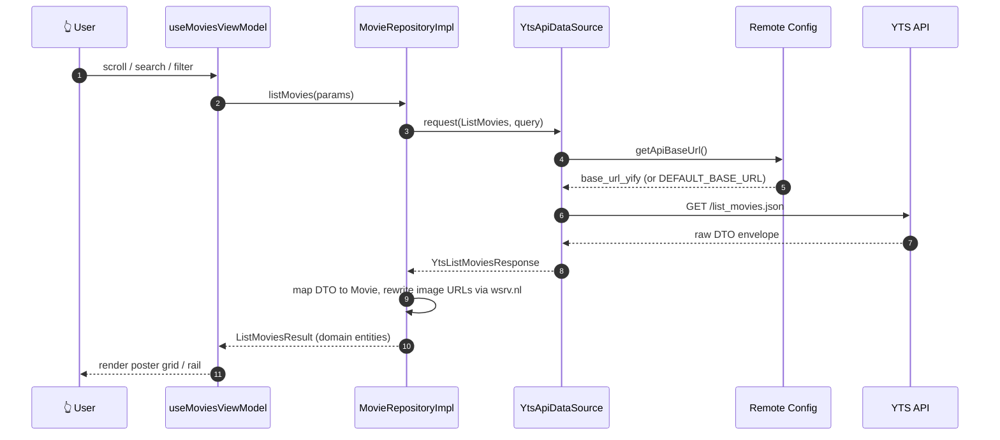
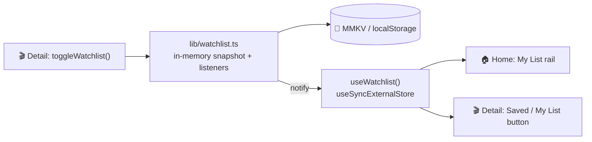
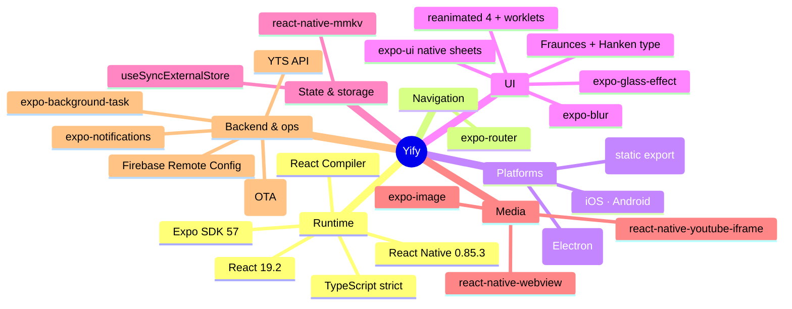

<div align="center">

# 🎬 Yify

**A streaming-grade movie browser built with Expo + React Native — one codebase, four platforms.**

A curated, Netflix-style home of editorial rails and a rotating billboard hero; a fast,
deep-linkable browse-and-filter grid; and cinematic detail pages with inline trailers and
"More like this" — all wrapped in iOS 26 liquid-glass UI and a strict clean-architecture core.

[](https://docs.expo.dev/)
[](https://reactnative.dev/)
[](https://react.dev/)
[](https://www.typescriptlang.org/)
[](#️-architecture)
[](#-over-the-air-updates)
[](#-get-started)

</div>

---

## 📖 Table of contents

- [What it is](#-what-it-is)
- [Features](#-features)
- [Screens & navigation](#-screens--navigation)
- [The curated home](#-the-curated-home)
- [Architecture](#️-architecture)
- [How a movie loads](#-how-a-movie-loads)
- [My List](#-my-list)
- [New-release notifications](#-new-release-notifications)
- [Over-the-air updates](#-over-the-air-updates)
- [Project layout](#️-project-layout)
- [Get started](#-get-started)
- [Tech stack](#-tech-stack)
- [Firebase Remote Config](#-firebase-remote-config)
- [Contributing](#-contributing)

---

## 🍿 What it is

Yify turns the [YTS](https://yts.mx/) catalog into a proper streaming-app experience. Every
surface is built from **four existing YTS endpoints** — `list_movies`, `movie_details`,
`movie_suggestions`, `movie_parental_guides` — with **zero new backend**. The discovery
experience is editorialized the way the best streaming apps do it: a full-bleed hero, a stack
of horizontal rails, a ranked Top 10, and recommendations on every detail page.

It ships from a **single TypeScript codebase** to **iOS, Android, the web, and the desktop**
(via an Electron shell that wraps the web export), and updates over the air without an app-store
round-trip.

---

## ✨ Features

- 🎞️ **Curated home** — a rotating full-bleed `HeroBillboard` over a stack of editorial rails: a ranked **Top 10 This Week** with oversized numerals, **My List**, **Critically Acclaimed**, **Just Added**, **Loved by Viewers**, **4K Ultra HD**, and genre rows. Each rail is a different query against the same API, fanned out in parallel.
- 🔎 **Deep-linkable browse** — the classic infinite poster grid lives at `/browse`, seedable from any hero CTA or rail "See all" with genre / quality / rating / sort / search pre-applied.
- 🎥 **Cinematic detail pages** — full-bleed backdrop with the title set *over* the art, a prominent **Play Trailer** CTA (embedded YouTube), cast, screenshots with a pinch-to-zoom lightbox, parental guides, and a **More like this** rail powered by `movie_suggestions`.
- 🔖 **My List** — save any title with one tap; it persists locally (MMKV) and shows up as its own rail on the home screen, wired through React's `useSyncExternalStore`.
- 🧊 **Liquid glass everywhere** — native `expo-glass-effect` on iOS 26 with a graceful `BlurView` fallback on older iOS and Android.
- 🎚️ **Native filter sheet** — quality / rating / genre / sort in a device-corner-radius bottom sheet that looks identical on iOS and Android.
- 🔔 **New-release notifications** — a background task diffs the catalog and pings you when fresh titles land; tapping the notification deep-links straight into the movie.
- ☁️ **Firebase Remote Config** — the API base URL is resolved at runtime, so the backend can move without shipping an update.
- 🚀 **Over-the-air updates** — JS/asset updates roll out through RevoPush (CodePush) without an app-store review.
- 🖥️ **True desktop app** — the same UI runs as a native macOS / Windows / Linux binary via Electron, with its own new-movie tray notifier.

---

## 🧭 Screens & navigation

A three-route `expo-router` stack — no tab bar; the home *is* the product.

```
/  (index)      → HomeScreen         curated hero + rails (the landing surface)
/browse         → MoviesScreen       search + filters grid (deep-linkable)
/movie/[id]     → MovieDetailsScreen  cinematic hero + trailer + More like this
```

Everything stays connected: the home search pill and every rail's **See all** deep-link into
`/browse` with the right filters pre-applied, and a tapped **new-release notification** routes
directly to `/movie/[id]`.



---

## 🏠 The curated home

`useHomeViewModel` fans out one `list_movies` request per shelf in parallel, so the whole
landing screen hydrates in a single wave. Shelves are pure configuration
(`presentation/movies/constants/homeShelves.ts`) — add a row by adding an object, no new code:

| Shelf | Style | YTS query |
| --- | --- | --- |
| **Top 10 This Week** | ranked (outlined numerals) | `sort_by=download_count` |
| **My List** | your saved titles | local (MMKV) |
| **Critically Acclaimed** | standard rail | `sort_by=rating`, `minimum_rating=7` |
| **Just Added** | standard rail | `sort_by=date_added` |
| **Loved by Viewers** | standard rail | `sort_by=like_count` |
| **4K Ultra HD** | standard rail | `quality=2160p` |
| **Action & Adventure** · **Sci-Fi & Fantasy** · **Comedy** · **Horror** | genre rails | `genre=…` |

The `HeroBillboard` auto-advances through the top-downloaded, well-rated titles, with a scrim,
title, metadata, and CTAs layered over the backdrop art YTS already returns.

---

## 🏛️ Architecture

Yify follows **clean architecture** — the same module shape you'd build with Gradle modules on
Android. Independent layers, each with a single public barrel (`index.ts`), wired together only
at the `app` composition root.



### The one rule that matters

> **`domain` depends on nothing. `data` and `presentation` depend only on `domain`. They may never import each other.**

This is **enforced by ESLint** (`import/no-restricted-paths` in `eslint.config.js`) — an illegal
cross-module import fails `npm run lint`. Cross-module imports must go through a module's barrel
(`@/domain`), never a deep path.



---

## 🔄 How a movie loads

From tap to pixels — the request path through every layer:



---

## 🔖 My List

Saving a movie is a single source of truth with zero prop-drilling. `lib/watchlist.ts` is a tiny
observable store persisted to disk; the UI subscribes through React's `useSyncExternalStore`, so a
save on the detail page instantly updates the **My List** rail on home and the save button
everywhere else.



Persistence goes through the same `lib/storage` abstraction as everything else: **MMKV** on native,
**localStorage** on web, behind one `KeyValueStore` interface picked at build time via a `.web` split.

---

## 🔔 New-release notifications

On launch the app requests notification permission and registers a background task. The task
fetches the latest titles, **diffs** them against a cached fingerprint (`lib/new-movies-diff.ts`,
covered by unit tests), and raises a local notification for anything new. Tapping it deep-links
straight to `/movie/[id]`.

The diff logic is shared; only the delivery differs per platform:

| Platform | Mechanism |
| --- | --- |
| iOS / Android | `expo-background-task` + `expo-notifications` |
| Web | Foreground checks + the browser `Notification` API |
| Desktop | Electron tray notifier (`desktop/new-movies-notifier.js`) |

---

## 🚀 Over-the-air updates

Native builds ship JS and asset updates **over the air** through
[RevoPush](https://revopush.org/) (a CodePush server), so most changes reach users without an
app-store review. `RootLayout` is wrapped with CodePush (`checkFrequency: ON_APP_RESUME`) on
native only — the web/desktop bundle never imports it, keeping `yarn export:web` clean. Separate
staging and production deployment keys exist per platform.

The repo also ships **`revopush/`** — a standalone, clean-architecture TUI/GUI release console
(`yarn revopush`) that drives RevoPush logins, base releases, and CodePush rollouts with
guardrails.

---

## 🗂️ Project layout

```
yify/
├─ app/                      # 📱 expo-router routes (composition root)
│  ├─ _layout.tsx            #    Stack, theming, fonts, Firebase + notifications init, CodePush
│  ├─ index.tsx              #    Home — wires data → HomeScreen
│  ├─ browse.tsx             #    Deep-linkable browse grid (reads filters from the URL)
│  └─ movie/[id].tsx         #    Movie details route
├─ domain/                   # 🧠 pure interfaces & entities (zero deps)
│  ├─ entities/              #    Movie · MovieDetails · Torrent · CastMember · ParentalGuide
│  └─ repositories/          #    MovieRepository (interface)
├─ data/                     # 💾 YTS API + DTO → entity mapping
│  ├─ datasources/           #    YtsApiDataSource, YtsEndpoint enum
│  ├─ models/                #    one DTO per file
│  └─ repositories/          #    MovieRepositoryImpl
├─ presentation/             # 🎨 screens, view models, shared UI
│  ├─ movies/                #    Home / Movies / Details screens + view models
│  │  ├─ components/         #    HeroBillboard · MovieRail · poster · lightbox · trailer
│  │  └─ constants/          #    homeShelves, filter options
│  ├─ components/            #    LiquidGlassView · ThemedText/View · icons
│  ├─ hooks/                 #    color scheme, theme color, corner radius, responsive
│  └─ constants/             #    theme (Fraunces + Hanken type system, palette)
├─ lib/                      # 🔌 cross-cutting concerns (native + .web splits)
│  ├─ storage/              #    KeyValueStore: MMKV (native) / localStorage (web)
│  ├─ watchlist.ts          #    My List observable store
│  ├─ remote-config.ts      #    Firebase Remote Config
│  └─ new-movies-*.ts       #    diff / cache / background task (+ unit tests)
├─ config/                   # 🔥 google-services.json / GoogleService-Info.plist
├─ desktop/                  # 🖥️ Electron shell + tray notifier (wraps the web export)
├─ revopush/                 # 🚀 clean-arch OTA release console (TUI + GUI)
├─ plugins/                  # 🧩 config plugin — injects CodePush deployment keys
└─ scripts/                  # 🛠️ android debug/release build helpers
```

---

## 🚀 Get started

```bash
# 1. install
npm install

# 2. (optional) Firebase — copy and fill in your keys
cp .env.example .env

# 3. start the dev server
npm start
```

### Run on a platform

| Command | What it does |
| --- | --- |
| `npm run ios` | iOS simulator (needs Xcode at `/Applications/Xcode.app`) |
| `npm run android` | Android emulator / connected device |
| `npm run android:debug` | Scripted Android **debug** build |
| `npm run android:release` | Scripted Android **release** build (standalone APK) |
| `npm run web` | Browser |
| `npm run export:web` | Static web export (deployed to GitHub Pages) |
| `npm run desktop` | Build the web export and launch the **Electron** desktop app |
| `npm run desktop:build` | Package a macOS desktop binary (`:build:all` for mac/win/linux) |
| `npm run revopush` | Launch the RevoPush release console |
| `npm run lint` | ESLint **+ module-boundary enforcement** |
| `npm run prebuild` | Regenerate native `ios/` & `android/` |

> 💡 Release builds embed the JS bundle — no Metro required. Unplug and go.

---

## 🧰 Tech stack



> ⚠️ **Version ceiling:** React Native is pinned to **0.85.3**. RN 0.86 breaks Expo SDK 56/57 native
> modules (the JSI `Runtime` → `IRuntime` ABI change) and crashes at launch. A `patch-package` patch
> keeps `expo-modules-core` building against the pinned runtime.

---

## 🔥 Firebase Remote Config

The YTS API base URL is **not hardcoded** — it's resolved at runtime from Remote Config key
`base_url_yify`, falling back to the data module's `DEFAULT_BASE_URL`. Native uses
`@react-native-firebase/remote-config`; web uses the Firebase JS SDK (gated on `isSupported()`). The
`data` module stays completely Firebase-agnostic — the base URL is injected as a `() => string`
provider from the composition root.

Firebase degrades gracefully: with no `.env` keys, the app simply uses the default URL.

---

## 🤝 Contributing

1. **Keep the layers honest.** If `npm run lint` fails on an `import/no-restricted-paths` rule, you
   crossed a module boundary. Route it through a barrel (`@/domain`) or rethink the dependency.
2. **One DTO / entity per file.**
3. **Reuse the primitives** — `ThemedText` / `ThemedView` / `LiquidGlassView` / `MovieRail` instead
   of new styled one-offs.
4. **Add a home shelf** by appending to `homeShelves.ts` — no new components required.

---

<div align="center">

Built with 🎥 and a lot of liquid glass.

</div>
