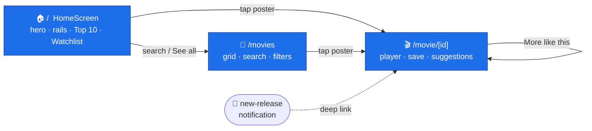
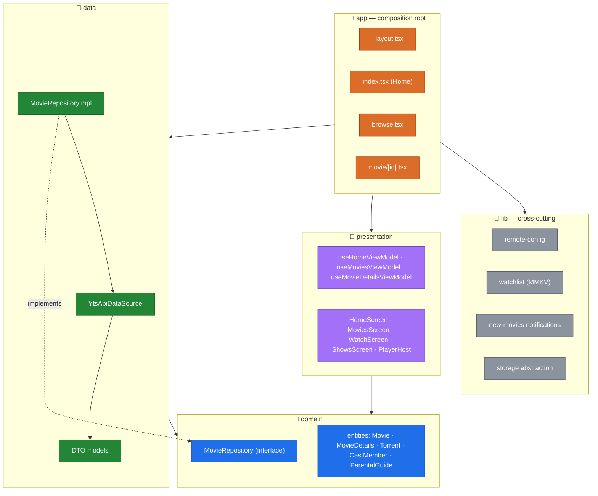
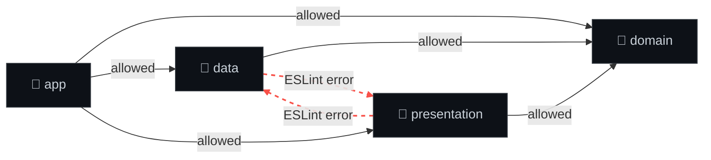
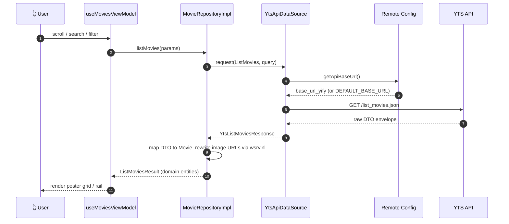
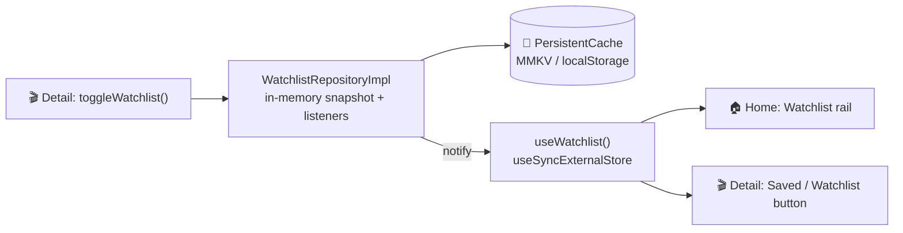
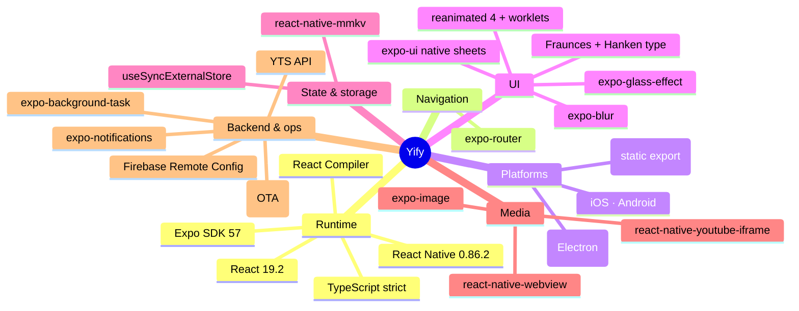

<div align="center">

# 🎬 Yify

**A streaming-grade movie browser built with Expo + React Native — one codebase, four platforms.**

A curated, Netflix-style home of editorial rails and a rotating billboard hero; a fast,
deep-linkable browse-and-filter grid; and cinematic detail pages with inline trailers and
"More like this" — all wrapped in iOS 26 liquid-glass UI and a strict clean-architecture core.

[](https://docs.expo.dev/)
[](https://reactnative.dev/)
[](https://react.dev/)
[](https://www.typescriptlang.org/)
[](#️-architecture)
[](#-over-the-air-updates)
[](#-get-started)

**[yify.expo.app](https://yify.expo.app/)**

</div>

---

## 📖 Table of contents

- [What it is](#-what-it-is)
- [Features](#-features)
- [Screens & navigation](#-screens--navigation)
- [The curated home](#-the-curated-home)
- [Architecture](#️-architecture)
- [How a movie loads](#-how-a-movie-loads)
- [Watchlist](#-watchlist)
- [New-release notifications](#-new-release-notifications)
- [Over-the-air updates](#-over-the-air-updates)
- [Project layout](#️-project-layout)
- [Get started](#-get-started)
- [EAS](#️-eas)
- [Tech stack](#-tech-stack)
- [Firebase Remote Config](#-firebase-remote-config)
- [Signing in](#-signing-in)
- [Contributing](#-contributing)

---

## 🍿 What it is

Yify turns the [YTS](https://yts.mx/) catalog into a proper streaming-app experience. Every
surface is built from **four existing YTS endpoints** — `list_movies`, `movie_details`,
`movie_suggestions`, `movie_parental_guides` — with **zero new backend**. The discovery
experience is editorialized the way the best streaming apps do it: a full-bleed hero, a stack
of horizontal rails, a ranked Top 10, and recommendations on every detail page.

It ships from a **single TypeScript codebase** to **iOS, Android, the web, and the desktop**
(via an Electron shell that wraps the web export), and updates over the air without an app-store
round-trip.

---

## ✨ Features

- 🎞️ **Curated home** — a rotating full-bleed `HeroBillboard` over a stack of editorial rails: a ranked **Top 10 This Week** with oversized numerals, **Watchlist**, **Critically Acclaimed**, **Just Added**, **Loved by Viewers**, **4K Ultra HD**, and genre rows. Each rail is a different query against the same API, fanned out in parallel.
- 🔎 **Deep-linkable movies** — the infinite poster grid lives at `/movies`, seedable from any hero CTA or rail "See all" with genre / quality / rating / sort / search pre-applied, and topped by a YouTube-style chip rail.
- 🎥 **YouTube-style watch page** — the trailer plays at the top of `/movie/[id]` with the title, an action pill row, a collapsible description, cast, screenshots with a pinch-to-zoom lightbox, and a **More like this** rail powered by `movie_suggestions`.
- 📺 **A player that follows you** — one embed is mounted once at the router root and never unmounts, animating between the watch page and a docked miniplayer so a trailer keeps playing while you browse. Web adds keyboard shortcuts and Document Picture-in-Picture.
- 📡 **Shows (early)** — `/shows` groups EZTV episode releases into series by IMDb id. The index is blocked on many networks, so the screen falls back to a coming-soon panel rather than an error.
- 🔖 **Watchlist** — save any title with one tap; it persists locally (MMKV) and shows up as its own rail on the home screen, wired through React's `useSyncExternalStore`.
- 🧊 **Liquid glass everywhere** — native `expo-glass-effect` on iOS 26 with a graceful `BlurView` fallback on older iOS and Android.
- 🎚️ **Native filter sheet** — quality / rating / genre / sort in a device-corner-radius bottom sheet that looks identical on iOS and Android.
- 🔔 **New-release notifications** — a background task diffs the catalog and pings you when fresh titles land; tapping the notification deep-links straight into the movie.
- ☁️ **Firebase Remote Config** — the API base URL and the TMDB key are resolved at runtime, so the backend can move and keys can rotate without shipping an update.
- 🚀 **Over-the-air updates** — JS/asset updates roll out through EAS Update without an app-store review.
- 🖥️ **True desktop app** — the same UI runs as a native macOS / Windows / Linux binary via Electron, with its own new-movie tray notifier.

---

## 🧭 Screens & navigation

An `expo-router` stack with a single persistent top bar — no tab bar; the home *is* the product.

```
/  (index)      → HomeScreen     hero + rails, then chips over an endless grid
/movies         → MoviesScreen   search + filters grid (deep-linkable)
/shows          → ShowsScreen    series grouped from EZTV, or coming-soon
/watchlist        → WatchlistScreen   saved titles as a playlist
/preferences    → PreferencesScreen theme, movie defaults, notifications
/movie/[id]     → WatchScreen    player + actions + description + More like this
```

Everything stays connected: the search pill and every rail's **See all** deep-link into
`/movies` with the right filters pre-applied, and a tapped **new-release notification** routes
directly to `/movie/[id]`. The player outlives every one of these transitions.


```mermaid
flowchart LR
    Home["🏠 /  HomeScreen<br/>hero · rails · Top 10 · Watchlist"]
    Browse["🔎 /movies<br/>grid · search · filters"]
    Detail["🎬 /movie/[id]<br/>player · save · suggestions"]
    Notif(["🔔 new-release<br/>notification"])

    Home -->|tap poster| Detail
    Home -->|search / See all| Browse
    Browse -->|tap poster| Detail
    Detail -->|More like this| Detail
    Notif -.deep link.-> Detail

    classDef s fill:#1f6feb,stroke:#0d419d,color:#fff
    class Home,Browse,Detail s
```

---

## 🏠 The curated home

`useHomeViewModel` fans out one `list_movies` request per shelf in parallel, so the whole
landing screen hydrates in a single wave. Shelves are pure configuration
(`presentation/movies/constants/homeShelves.ts`) — add a row by adding an object, no new code:

| Shelf | Style | YTS query |
| --- | --- | --- |
| **Top 10 This Week** | ranked (outlined numerals) | `sort_by=download_count` |
| **Watchlist** | your saved titles | local (MMKV) |
| **Critically Acclaimed** | standard rail | `sort_by=rating`, `minimum_rating=7` |
| **Just Added** | standard rail | `sort_by=date_added` |
| **Loved by Viewers** | standard rail | `sort_by=like_count` |
| **4K Ultra HD** | standard rail | `quality=2160p` |
| **Action & Adventure** · **Sci-Fi & Fantasy** · **Comedy** · **Horror** | genre rails | `genre=…` |

The `HeroBillboard` auto-advances through the top-downloaded, well-rated titles, with a scrim,
title, metadata, and CTAs layered over the backdrop art YTS already returns.

---

## 🏛️ Architecture

Yify follows **clean architecture** — the same module shape you'd build with Gradle modules on
Android. Independent layers, each with a single public barrel (`index.ts`), wired together only
at the `app` composition root.


```mermaid
flowchart TD
    subgraph app["📱 app — composition root"]
        L["_layout.tsx"]
        I["index.tsx (Home)"]
        B["browse.tsx"]
        M["movie/[id].tsx"]
    end

    subgraph presentation["🎨 presentation"]
        VM["useHomeViewModel · useMoviesViewModel · useMovieDetailsViewModel"]
        UI["HomeScreen · MoviesScreen · WatchScreen · ShowsScreen · PlayerHost"]
    end

    subgraph domain["🧠 domain"]
        E["entities: Movie · MovieDetails · Torrent · CastMember · ParentalGuide"]
        R["MovieRepository (interface)"]
    end

    subgraph data["💾 data"]
        DS["YtsApiDataSource"]
        IMPL["MovieRepositoryImpl"]
        DTO["DTO models"]
    end

    subgraph lib["🔌 lib — cross-cutting"]
        RC["remote-config"]
        WL["watchlist (MMKV)"]
        NM["new-movies notifications"]
        ST["storage abstraction"]
    end

    app --> presentation
    app --> data
    app --> lib
    presentation --> domain
    data --> domain
    IMPL -. implements .-> R
    DS --> DTO
    IMPL --> DS

    classDef domainCls fill:#1f6feb,stroke:#0d419d,color:#fff
    classDef dataCls fill:#238636,stroke:#196127,color:#fff
    classDef presCls fill:#a371f7,stroke:#6e40c9,color:#fff
    classDef appCls fill:#db6d28,stroke:#9e4112,color:#fff
    classDef libCls fill:#8b949e,stroke:#57606a,color:#fff
    class E,R domainCls
    class DS,IMPL,DTO dataCls
    class VM,UI presCls
    class L,I,B,M appCls
    class RC,WL,NM,ST libCls
```

### The one rule that matters

> **`domain` depends on nothing. `data` and `presentation` depend only on `domain`. They may never import each other.**

This is **enforced by ESLint** (`import/no-restricted-paths` in `eslint.config.js`) — an illegal
cross-module import fails `npm run lint`. Cross-module imports must go through a module's barrel
(`@/domain`), never a deep path.


```mermaid
graph LR
    domain["🧠 domain"]:::ok
    data["💾 data"]:::ok
    presentation["🎨 presentation"]:::ok
    app["📱 app"]:::ok

    data -->|allowed| domain
    presentation -->|allowed| domain
    app -->|allowed| domain
    app -->|allowed| data
    app -->|allowed| presentation
    data -. ESLint error .-> presentation
    presentation -. ESLint error .-> data

    classDef ok fill:#0d1117,stroke:#30363d,color:#c9d1d9
    linkStyle 5,6 stroke:#f85149,stroke-width:2px,stroke-dasharray:5 5
```

---

## 🔄 How a movie loads

From tap to pixels — the request path through every layer:


```mermaid
sequenceDiagram
    autonumber
    participant U as 👆 User
    participant VM as useMoviesViewModel
    participant Repo as MovieRepositoryImpl
    participant DS as YtsApiDataSource
    participant RC as Remote Config
    participant API as YTS API

    U->>VM: scroll / search / filter
    VM->>Repo: listMovies(params)
    Repo->>DS: request(ListMovies, query)
    DS->>RC: getApiBaseUrl()
    RC-->>DS: base_url_yify (or DEFAULT_BASE_URL)
    DS->>API: GET /list_movies.json
    API-->>DS: raw DTO envelope
    DS-->>Repo: YtsListMoviesResponse
    Repo->>Repo: map DTO to Movie, rewrite image URLs via wsrv.nl
    Repo-->>VM: ListMoviesResult (domain entities)
    VM-->>U: render poster grid / rail
```

---

## 🔖 Watchlist

Saving a movie is a single source of truth with zero prop-drilling. `WatchlistRepositoryImpl` is a
tiny observable store persisted to disk; the UI subscribes through React's `useSyncExternalStore`, so a
save on the detail page instantly updates the **Watchlist** rail on home and the save button
everywhere else.


```mermaid
flowchart LR
    Btn["🎬 Detail: toggleWatchlist()"] --> Store
    Store["WatchlistRepositoryImpl<br/>in-memory snapshot + listeners"] --> MMKV[("💾 PersistentCache<br/>MMKV / localStorage")]
    Store -->|notify| Hook["useWatchlist()<br/>useSyncExternalStore"]
    Hook --> Rail["🏠 Home: Watchlist rail"]
    Hook --> Save["🎬 Detail: Saved / Watchlist button"]
```

Persistence goes through the same `PersistentCache` as everything else: **MMKV** on native,
**localStorage** on web, behind the `KeyValueStore` port picked at build time via a `.web` split.
`SessionCache` is the in-memory sibling used by tests.

---

## 🔔 New-release notifications

On launch the app requests notification permission and registers a background task. The task
fetches the latest titles, **diffs** them against a cached fingerprint (`domain/policies/newMoviesNotification.ts`,
covered by unit tests), and raises a local notification for anything new. Tapping it deep-links
straight to `/movie/[id]`.

The diff logic is shared; only the delivery differs per platform:

| Platform | Mechanism |
| --- | --- |
| iOS / Android | `expo-background-task` + `expo-notifications` |
| Web | Foreground checks + the browser `Notification` API |
| Desktop | Electron tray notifier (`desktop/new-movies-notifier.js`) |

---

## Ad performance in RevenueCat

Android interstitial ads report loaded, displayed, clicked, failed-to-load, and revenue events
to RevenueCat's `AdTracker`. Each ad instance shares one impression ID and the `movie_open`
placement across its events. AdMob's `OPENED` callback means the ad is visible; only `CLICKED`
is reported as RevenueCat's **Ad Opened** event. The installed AdMob wrapper does not expose a
separate interstitial impression callback, so display counts use its visible-ad callback.

To view the data in [this project's Ads dashboard](https://app.revenuecat.com/projects/8b6ff243/ads):

1. Open the RevenueCat Ads page and opt in to ad monetization if prompted.
2. Enable **Impression-level ad revenue** in the AdMob account's Settings. Without it, AdMob
   does not send the paid callbacks that supply revenue amounts.
3. Confirm the app's RevenueCat Android public SDK key belongs to this project. Production
   updates use the key in Expo's `production` environment.
4. Use **Sandbox data** when testing a debug build with Google's test ads. RevenueCat's native
   SDK marks debug events as sandbox; never click your own production ads to test tracking.

The SDK manages event batching and delivery. Tracking does not wait for purchase offerings or
entitlement requests, and rejected SDK calls produce a sanitized Firebase `ad_tracking_failed`
diagnostic. Invalid paid amounts/currencies are discarded instead of recorded as invented revenue.
Web and desktop have no native ads and keep a no-op tracking implementation.

See RevenueCat's [manual integration guide](https://www.revenuecat.com/docs/ad-monetization/manual-integration)
for event definitions and dashboard troubleshooting. Connecting AdMob in RevenueCat is optional
and makes ad unit names readable; it does not replace the app's event tracking.

---

## 🚀 Over-the-air updates

Native builds ship JS and asset updates **over the air** through
[EAS Update](https://docs.expo.dev/eas-update/introduction/), so most changes reach users without
an app-store review. `ExpoAppUpdates` checks on launch and on every foreground, then surfaces a
restart prompt through `UpdateSnackbar`. The web/desktop bundle resolves the `.web.ts` no-op twin,
keeping `yarn export:web` clean.

Updates are keyed by **`runtimeVersion`**, which is declared as the `package.json` version rather
than derived from a fingerprint. Fingerprints proved unreliable here — the console, gradle and
`eas update` each hashed their own view of the tree and produced three different values for one
build. Declaring it means every tool reads the same string by construction, at the cost of one
rule: **bump the version whenever native code changes**, or old binaries will accept an update
they cannot run. `Staging` and `Production` are EAS **channels**, baked into the binary at
prebuild time from `EXPO_UPDATE_CHANNEL`.

`release/releases.json` records what actually shipped: the store-release flow writes the runtime
version of every binary it ships, and the update flow refuses to publish for a runtime version that
has no store release — an update nobody could receive. It stays authoritative for locally built
binaries, which EAS has no record of.

The repo also ships **`release/`** — a standalone, clean-architecture TUI/GUI release console
(`yarn release`) that drives Expo logins, store releases, and EAS Update rollouts with guardrails.
For Android Production, select Android and Production, leave the APK empty, validate, and release.
The console builds the current repository on Expo with the `production` profile, then submits that
build to Google Play using `play-production`. Staging continues to build locally and distribute an
APK through Firebase App Distribution; a supplied APK is accepted when only Staging is selected.
Selecting both channels requires an empty APK field and creates a separate build for each channel.
The iOS flow records a supplied IPA for updates; upload it to App Store Connect separately.

---

## 🗂️ Project layout

```
yify/
├─ app/                      # 📱 expo-router routes — thin adapters only
│  ├─ _layout.tsx            #    Stack, theming, fonts, createDependencies() + bootstrap()
│  ├─ index.tsx              #    Home route
│  ├─ movies.tsx             #    Deep-linkable browse grid (reads filters from the URL)
│  └─ movie/[id].tsx         #    Watch route
├─ domain/                   # 🧠 pure abstractions (zero deps)
│  ├─ entities/              #    Movie · MovieQuery · Account · Preferences · Entitlement · …
│  ├─ repositories/          #    data-access ports — MovieRepository · WatchlistRepository · …
│  ├─ services/              #    behaviour ports — AnalyticsSink · AppConfig · AccountSync · …
│  ├─ policies/              #    pure business rules (+ unit tests)
│  └─ Dependencies.ts        #    the port bag the composition root satisfies
├─ data/                     # 💾 every implementation detail & platform SDK
│  ├─ di/                    #    ⚙️ composition root — the ONLY module naming *Impl
│  ├─ datasources/           #    YTS · EZTV · TMDB · Firebase · analytics · storage · sync
│  ├─ models/                #    one DTO per file
│  ├─ repositories/          #    *Impl (+ .web.ts twins)
│  └─ services/              #    RemoteAppConfig · AccountSyncImpl · PlayStoreServices · …
├─ presentation/             # 🎨 screens, view models, shared UI
│  ├─ di/                    #    DependenciesProvider + per-port hooks
│  ├─ analytics/             #    the event catalog (UI vocabulary)
│  ├─ movies/                #    Home / Movies / Details screens + view models
│  │  ├─ components/         #    HeroBillboard · MovieRail · cards · chips · sheets
│  │  ├─ player/             #    persistent player · miniplayer · shortcuts
│  │  └─ constants/          #    homeShelves, filter labels
│  ├─ components/            #    LiquidGlassView · ThemedText/View · icons
│  ├─ hooks/                 #    color scheme, theme color, corner radius, responsive
│  └─ constants/             #    theme (Fraunces + Hanken type system, palette)
├─ config/                   # 🔥 google-services.json / GoogleService-Info.plist
├─ desktop/                  # 🖥️ Electron shell + tray notifier (wraps the web export)
├─ release/                  # 🚀 clean-arch release console (TUI + GUI) + releases.json ledger
├─ plugins/                  # 🧩 config plugins — Android release, R8 heap, GWP-ASan, ad-id opt-out
└─ scripts/                  # 🛠️ android debug/release build helpers
```

---

## 🚀 Get started

```bash
# 1. install
npm install

# 2. (optional) Firebase — copy and fill in your keys
cp .env.example .env

# 3. start the dev server
npm start
```

### Run on a platform

| Command                   | What it does                                                    |
|---------------------------|-----------------------------------------------------------------|
| `npm run ios`             | iOS simulator (needs Xcode at `/Applications/Xcode.app`)        |
| `npm run android`         | Android emulator / connected device                             |
| `npm run android:debug`   | Scripted Android **debug** build                                |
| `npm run android:release` | Scripted Android **release** build (standalone APK)             |
| `npm run web`             | Browser                                                         |
| `npm run export:web`      | Static web export (deployed to the GitHub Pages mirror)         |
| `npm run desktop`         | Build the web export and launch the **Electron** desktop app    |
| `npm run desktop:build`   | Package a macOS desktop binary (`:build:all` for mac/win/linux) |
| `npm run release`         | Launch the release console (store releases + EAS Update)        |
| `npm run lint`            | ESLint **+ module-boundary enforcement**                        |
| `npm run prebuild`        | Regenerate native `ios/` & `android/`                           |

> 💡 Release builds embed the JS bundle — no Metro required. Unplug and go.

---

## ☁️ EAS

The release console uses **EAS Build and EAS Submit for Android Production**. Android Staging
continues to use local Gradle builds and Firebase App Distribution. EAS also provides cloud iOS
builds, shareable internal builds, and hosted web. The commands below route through `scripts/eas.sh`,
which reuses the release console's `EXPO_TOKEN`, so there is no separate login.

### Development builds

A [development build](https://docs.expo.dev/develop/development-builds/introduction/) is your own
app with the dev launcher inside it — the same native code as a release build, but able to load JS
from Metro. It is the only way to exercise the native modules this app depends on (Firebase, Google
Sign-In, RevenueCat, MMKV) against a live bundle.

| Command | What it does |
| --- | --- |
| `npm run dev` | Metro for an installed dev build (`expo start --dev-client`) |
| `npm run android` | Build and install a dev build locally |
| `npm run build:dev:android` | Dev build APK on EAS |
| `npm run build:dev:ios` | Dev build for the iOS **simulator** (no Apple account needed) |
| `npm run build:dev:ios:device` | Dev build for a physical iPhone (needs an Apple account) |

### Cloud builds & submission

| Command | What it does |
| --- | --- |
| `npm run build:preview:android` | Internal-distribution APK on the `Staging` channel |
| `npm run build:production:android` | Store AAB on the `Production` channel |
| `npm run submit:android` | Upload an AAB to Play — **`internal` track, `draft`** |
| `npm run submit:android:play` | Submit an AAB to Play — `production` track, `completed` rollout |

The release console uses build profile `production` followed by submit profile `play-production`,
which targets Google Play's production track with a full rollout. It submits the exact completed
Expo build. A successful submission does not mean the release is publicly available: Google review
or managed publishing may still be pending. Check the release's publishing status in Google Play.

`submit:android` uses the separate internal/draft profile. For manual submission, select a specific
completed Expo build:

```bash
npm run submit:android:play -- --id <EAS_BUILD_ID>
```

Or pass `--path` to submit a locally built artifact to the internal track:

```bash
npm run submit:android -- --path android/app/build/outputs/bundle/release/app-release.aab
```

Signing is not duplicated. `scripts/setup-eas-credentials.sh` generates a gitignored
`credentials.json` from the same `~/.config/yify/signing.env` that
`scripts/setup-android-signing.sh` reads, and verifies the keystore SHA-1 before writing it — so a
cloud build cannot silently sign with a key Play would reject.

### Hosting

[EAS Hosting](https://docs.expo.dev/eas/hosting/introduction/) serves the canonical site at
**[yify.expo.app](https://yify.expo.app/)** — every `rel="canonical"`, `og:url` and the in-app
"Open Yify on the web" link points there. A push to `main` deploys it straight to the production
alias; `npm run deploy:hosting` does the same by hand and `:prod` promotes it.

GitHub Pages stays live as a mirror at `baseUrl=/yify`, building from `dist/` on every push to
`main`. Because the canonical URL is absolute, the mirror correctly defers to the hosting origin
rather than competing with it for the same queries.

Both deploys are gated on `scripts/check-web-export.mjs`, which fails the build if a route
prerenders an empty shell, loses its `<title>`, or drops a `public/` asset — the failure mode an
`expo export` exit code cannot see.

> ⚠️ Any new web origin must be added to Firebase Auth authorized domains and the Google OAuth
> client, or sign-in will fail there.

---

## 🧰 Tech stack


```mermaid
mindmap
  root((Yify))
    Runtime
      Expo SDK 57
      React Native 0.86.2
      React 19.2
      TypeScript strict
      React Compiler
    Navigation
      expo-router
    Platforms
      iOS · Android
      Web (static export)
      Desktop (Electron)
    UI
      expo-glass-effect
      expo-blur
      reanimated 4 + worklets
      expo-ui native sheets
      Fraunces + Hanken type
    State & storage
      react-native-mmkv
      useSyncExternalStore
    Media
      react-native-webview
      react-native-youtube-iframe
      expo-image
    Backend & ops
      YTS API
      Firebase Remote Config
      expo-notifications
      expo-background-task
      EAS Update (OTA)
```

> 📌 **Exact pins, no ranges.** Every dependency is pinned to an exact version — no `^`, no `~` —
> so `expo install` / `yarn add` ranges get stripped after every upgrade. The repo carries **no
> `patch-package` patches**; the old `expo-modules-core` JSI patch went away with RN 0.86, which
> ships `tryGetMutableBuffer` upstream.

---

## 🔥 Firebase Remote Config

The YTS API base URL is **not hardcoded** — it's resolved at runtime from Remote Config key
`base_url_yify`, falling back to the data module's `DEFAULT_BASE_URL`. Native uses
`@react-native-firebase/remote-config`; web uses the Firebase JS SDK (gated on `isSupported()`). The
`data` module stays completely Firebase-agnostic — the base URL is injected as a `() => string`
provider from the composition root.

Firebase degrades gracefully: with no `.env` keys, the app simply uses the default URL.

---

## 🔐 Signing in

Google is the only sign-in method. Web uses the Firebase JS SDK (`signInWithPopup`, falling back to
a redirect when the popup is blocked); native pairs `@react-native-google-signin/google-signin` with
`@react-native-firebase/auth`, exchanging the Google id token for a Firebase credential. Both sides
implement the identical `AuthRepository` port — `init`, `subscribe`, `getSession`, `signIn`,
`signOut`, `getIdToken` — so the UI never branches on platform.

Signing in exists to carry entitlements between devices. `AccountLink` watches auth state and
hands the Firebase uid to RevenueCat: `logIn(uid)` on the way in and `logOut()` on the way out.
Web uses `identifyUser` to link an anonymous customer at sign-in, then `changeUser` for account
switches and a fresh anonymous identity at sign-out. Purchases made on the phone therefore show
up on the web when the same account is used. SDK identity changes, checkout and restoration are
serialized, and stale results cannot grant access to another account. Entitlement caches are
account-scoped and respect subscription expiry. Restoration happens only when the customer
chooses it; foreground refresh checks current access without transferring store purchases.

### Supporter purchases and RevenueCat

Settings → **Support Yify** shows all packages in the applicable offering, with their localized
regular prices and actual billing periods. Existing supporters can see renewal/expiry information,
restore store purchases, refresh access and open the store or web billing-management URL.
On web, **Check account purchases** checks the signed-in RevenueCat customer; restoring an
App Store or Google Play purchase must be done in the mobile app with the original store account.

The custom paywall uses `settings_supporter` and `post_ad_supporter` placements. Without targeting
rules RevenueCat supplies the default offering. An explicit targeting exclusion stays empty.
Each visible offering records one RevenueCat custom paywall impression with its original offering
context and placement; checkout preserves the same context. Merely loading offers is not counted
as viewing a paywall. The optional post-ad prompt skips itself if loading plans takes over 1.5 seconds.

The configured `remove_ads` entitlement is shared by Android and Web monthly/lifetime products.
Do not change the entitlement identifier when editing offerings. Existing prices and products stay
in the RevenueCat/store catalogs, rather than being hardcoded in the app. Current SDKs support
this custom purchase experience through Expo OTA; adding RevenueCat's native managed Paywalls
or Customer Center UI package would require a new native build.

See [RevenueCat operations](docs/revenuecat-operations.md) for the verified product catalog,
Google Play notification connection, analytics setup and remaining account configuration.

Sign-in is optional and degrades quietly. The account row hides itself when the platform has nothing
to sign in with — no Firebase config on web, no `EXPO_PUBLIC_GOOGLE_WEB_CLIENT_ID` on native — so a
build without credentials simply has no account section.

Turning it on takes three things in the Firebase console: enable Google under Authentication →
Sign-in method, add the site's domain to the authorized list, and for Android register the signing
SHA-1 fingerprints and re-download `google-services.json`, which then carries the OAuth client this
build reads as its web client id.

---

## 🤝 Contributing

1. **Keep the layers honest.** If `npm run lint` fails on an `import/no-restricted-paths` rule, you
   crossed a module boundary. Route it through a barrel (`@/domain`) or rethink the dependency.
2. **One DTO / entity per file.**
3. **Reuse the primitives** — `ThemedText` / `ThemedView` / `LiquidGlassView` / `MovieRail` instead
   of new styled one-offs.
4. **Add a home shelf** by appending to `homeShelves.ts` — no new components required.

---

<div align="center">

Built with 🎥 and a lot of liquid glass.

</div>
